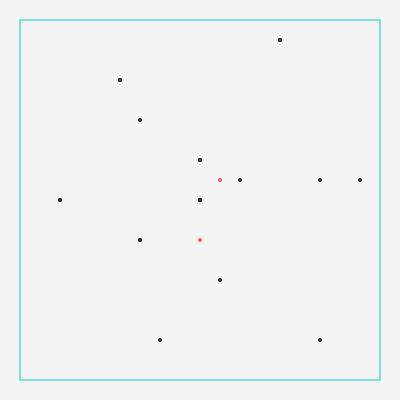
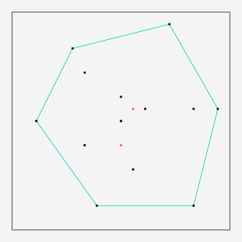
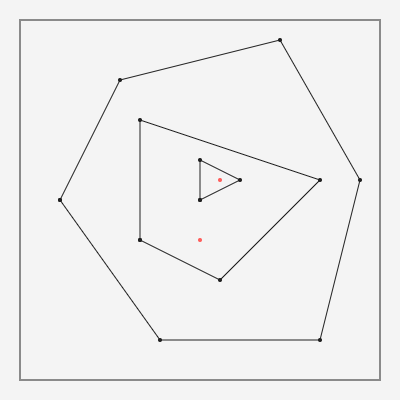
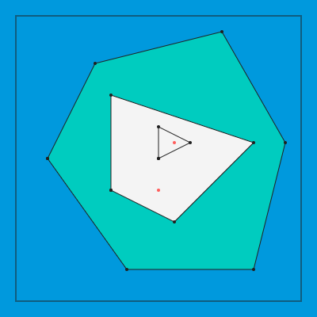
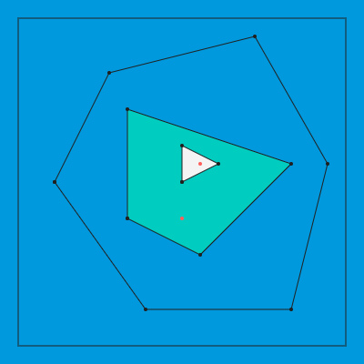

# 똥통에 빠진 휴대폰

| 시간 제한 | 메모리 제한 |
| :-: | :-: |
| 1초 | 1024MB |

종현은 자신이 볼일을 본 변기에 휴대폰을 빠뜨려버렸다. 이윽고 정신을 차리고 휴대폰을 변기에서 꺼냈을 땐, 휴대폰은 이미 변기 물을 머금은 뒤였다. 휴대폰을 건조시킨 종현이는 휴대폰에서 나는 암모니아 향기와 찝찝함을 이기지 못해 휴대폰을 락스 물에 담그기로 했다. 종현의 휴대폰 안에는 방수 씰이 여러 겹 붙어있으므로, 휴대폰을 적절한 시간 동안 락스 물에 담가놓으면 고장내지 않고 냄새만 제거할 수 있을 것이다.

* 휴대폰에는 나사 기둥과 침수 취약 부품, 방수 씰이 존재한다. 나사 기둥은 방수 씰을 고정하는 데 활용되고, 침수 취약 부품은 액체에 닿으면 고장난다.

* 모든 침수 취약 부품은 적어도 1개 이상의 방수 씰 안쪽에 위치하여 보호를 받고 있다.

(방수 씰의 설치) 방수 씰은 다음과 같은 방법으로 설치되었다.

* 휴대폰의 디스플레이와 뒷면 하우징을 방수 물질로 연결하여 액체의 휴대폰 침투를 막는다. 즉, 방수 씰은 부품을 덮는 것이 아닌, 방수 벽을 설치하는 방식으로 설치한다.

방수 씰은 휴대폰의 테두리를 따라 외곽에 설치되었다. 하지만 휴대폰 제조사는 방수 성능을 높이기 위해 다음과 같은 규칙에 따라 방수 씰을 추가 설치하였다.

* 나사 기둥을 직선으로 연결해 만들 수 있는 면적이 $0$보다 크면서 가장 넓은 다각형을 찾는다.

* 만약 그러한 다각형이 존재한다면 다각형을 따라 방수 씰을 설치한다.

* 방수 씰의 경로 상에 있는 모든 나사 기둥은 방수 씰의 설치에 소모된다. 즉, 방수 씰이 지나가는 선분 상에 세 개 이상의 나사 기둥이 위치한다면 해당하는 나사 기둥은 다른 방수 씰의 설치에 사용할 수 없다.

* 방수 씰을 설치한 후 같은 규칙으로 다각형을 더 찾을 수 있다면, 더 이상 다각형을 찾을 수 없을 때까지 같은 과정을 반복한다.

<br />

* 휴대폰의 테두리를 따라 외곽에 설치된 방수 씰을 0번 방수 씰이라고 한다.

* 0번 방수 씰은 입력으로 주어질 모든 나사 기둥과 침수 취약 부품을 둘러싸고 있으며, 0번 방수 씰을 고정하는 나사 기둥 등 0번 방수 씰에 대한 정보는 입력으로 주어지지 않는다.

* 0번 방수 씰의 보호를 받는 방수 씰 중 가장 바깥쪽의 방수 씰을 $1$번, $1$번 방수 씰의 보호를 받는 방수 씰 중 가장 바깥 쪽의 방수 씰을 $2$번, ... $i - 1$번 방수 씰의 보호를 받는 가장 바깥 쪽의 방수 씰을 $i$번 방수 씰이라고 한다.

* $i$번째 방수 씰의 방수 성능 유지 시간 $W_i$는 아래와 같이 정의한다. 방수 씰은 $W_i$가 초과되면 액체가 빠져나가거나 마를 때까지 방수 기능을 잃는다.

```math
W_i=\begin{cases}(aW_{i-1}+c)\mod m&(i\ge 1)\\ b&(i=0)\end{cases} \\
(0\le a,b,c\le 40;1\le m\le 40)
```

**가정**

* 방수 씰은 방수 범위의 경계까지 보호한다. 만약 방수 씰이 지나가는 선분 상에 침수 취약 부품이 위치한다면 방수 씰의 보호를 받는 것으로 판단한다.
* 모든 방수 씰의 두께와 나사 기둥 및 침수 취약 부품이 차지하는 면적은 무시한다.
* 방수 씰의 성능 유지 시간이 초과되어 액체가 방수 씰을 침투할 때, 액체가 방수 씰이 보호하고 있는 공간을 침수시키는 데 걸리는 시간은 고려하지 않는다.
* 락스 물이 휴대폰 내부를 세척하는 데 걸리는 시간은 고려하지 않는다. 락스 물이 침투한 부분의 공간은 침투한 즉시 세척되었다고 가정한다.
* 변기 물에서 건진 휴대폰의 방수 성능 유지 시간은 락스 물에 담그기 전에 복구된 것으로 간주한다.
* 휴대폰은 항상 볼록다각형이다.
* 모든 나사 기둥, 침수 취약 부품은 다른 나사 기둥, 침수 취약 부품과 같은 좌표를 공유하지 않는다.

만약 변기 물이 묻은 모든 나사 기둥들이 락스 물에 씻기기 전에, 종현이 락스 물에 담가놓은 휴대폰을 건지면 휴대폰 내부가 제대로 세척되지 않아 냄새가 날 것이다. 또한 락스 물이 침수 취약 부품까지 닿도록 휴대폰을 락스 물에 담가놓으면 휴대폰이 고장날 것이다.  

혹은 이미 변기 물이 휴대폰을 고장냈을 수도 있다. 휴대폰에서 냄새가 나거나 휴대폰이 고장난다면 종현은 새 휴대폰을 구매할 것이다.  

종현은 새 휴대폰을 구매하지 않고 똥통에 빠진 휴대폰을 그대로 사용할 수 있을까?

## 입력

첫 번째 줄에 휴대폰이 변기 물에 빠지고 변기 물이 마를 때까지 걸린 시간 $T_t$, 휴대폰을 락스 물에 담그고 락스 물이 마를 때까지 걸린 시간 $T_c$가 공백으로 구분되어 주어진다. $(1 \le T_t, T_c \le 100)$

두 번째 줄에 방수 성능 유지 시간 정의에 사용되는 $a, b, c, m$이 공백으로 구분되어 주어진다. $(0 \le a, b, c \le 40; 1 \le m \le 40)$

세 번째 줄에 전체 나사 기둥의 개수 $N_s$와 침수 취약 부품의 개수 $N_d$가 공백으로 구분되어 주어진다. $(0 \le N_s, N_d \le 10\, 000)$

네 번째 줄부터 $N_s$ 줄에 걸쳐 나사 기둥의 위치 좌표 $x$, $y$가 공백으로 구분되어 주어진다. $(-1\,000 \le x, y \le 1\, 000)$

$4+N_s$번째 줄부터 $N_d$줄에 걸쳐 침수 취약 부품의 위치 좌표 $x$, $y$가 공백으로 구분되어 주어진다. $(-1\,000 \le x, y \le 1\, 000)$

입력으로 주어지는 모든 수는 정수이다. 

## 출력

종현의 휴대폰이 고장나거나 냄새가 나서 휴대폰을 새로 구매해야 한다면 `Your purchases from Apple` 을, 새로 구매하지 않아도 된다면 `Your Apple ID was used to sign in to iCloud` 를 출력한다.

## 예제 입력 1
```
31 31
10 10 10 10
13 2
60 200
160 60
320 60
360 220
280 360
120 320
140 160
140 280
320 220
220 120
200 200
240 220
200 240
200 160
220 220
```

## 예제 출력 1
```
Your purchases from Apple
```

## 예제 입력 2
```
2 4
0 2 2 4
8 1
1 1
2 2
-1 -1
-2 -2
-1 1
-2 2
1 -1
2 -2
0 2
```

## 예제 출력 2
```
Your Apple ID was used to sign in to iCloud
```

## 노트

예제 입력 1을 아래와 같이 표현할 수 있다. 테두리의 사각형을 0번 방수 씰, 검은색 점을 나사 기둥, 빨간색 점은 침수 취약 부품이다.

  

0번 방수 씰은 휴대폰의 테두리를 따라 외곽에 설치되어있다.

  

나사 기둥을 직선으로 연결해 만들 수 있는, 면적이 0보다 큰 다각형이 존재한다면 가능한 한 다각형을 따라 방수 씰을 설치한다.

  

더 이상 다각형을 찾을 수 없을 때까지 같은 과정을 반복하여 방수 씰을 설치한다.

  

모든 방수 씰은 각자의 방수 성능 유지 시간이 있다. 방수 성능 유지 시간을 초과하여 침수된다면, 침수된 방수 씰은 더 이상 기능을 하지 못하고 침투한 액체를 통과시킨다.

  

침수 취약 부품이 침투한 액체와 접촉한다면 휴대폰은 고장날 것이다.
